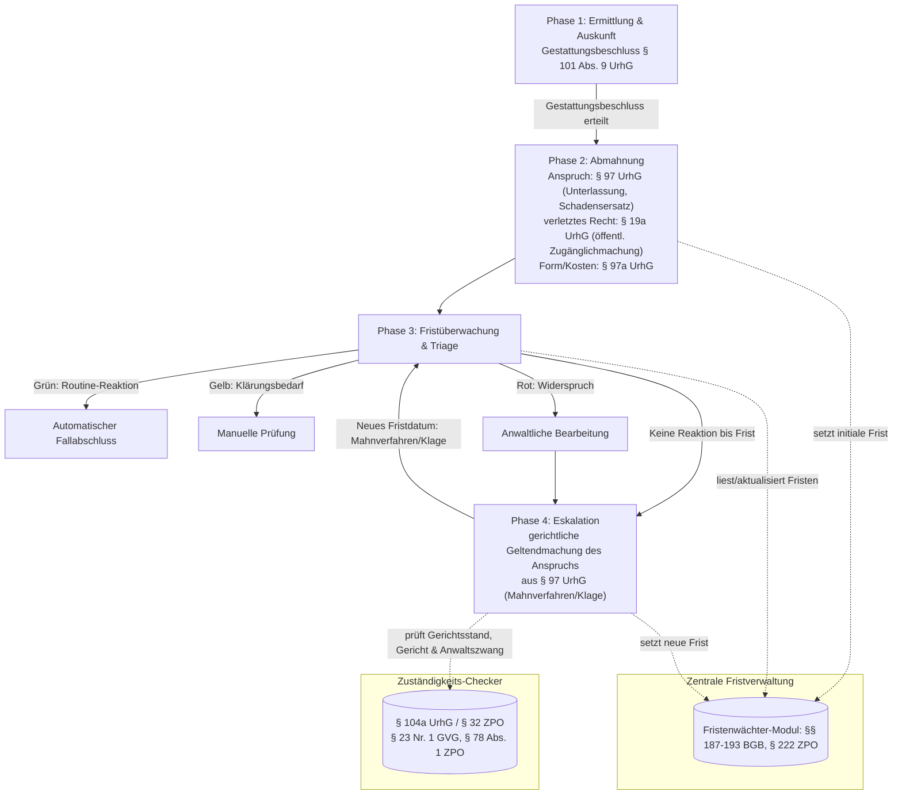

# Architektur: Case-Management für Filesharing-Massenabmahnverfahren

> Hinweis: Dieses Dokument wurde direkt aus der Aufgabenbeschreibung abgeleitet (es gab kein
> vorheriges Architektur-Dokument im Projekt). Es dient als Diskussionsgrundlage für den
> Prototyp, nicht als verbindliche Zielarchitektur.

## Kontext

Prototyp für den Case-Management-Workflow einer Kanzlei, die für Mandanten (z. B.
Gaming-Publisher) Filesharing-Urheberrechtsverletzungen verfolgt. Alle Daten im Prototyp sind
**fiktiv** (Test-IPs aus dem Dokumentations-Adressbereich nach RFC 5737, fiktive Werktitel und
Mandanten). Es werden keine echten Abmahnungen versendet und keine echten Personendaten
verarbeitet.

## Phasenmodell

**Verwendete Normen des UrhG:**

| Norm | Bedeutung im Workflow |
|---|---|
| § 19a UrhG | Recht der öffentlichen Zugänglichmachung — das durch Filesharing verletzte Verwertungsrecht; Grundlage der Rechtsverletzung, die in Phase 1 ermittelt wird |
| § 97 UrhG | Anspruch auf Unterlassung und Schadensersatz — materielle Anspruchsgrundlage für die Forderung in der Abmahnung (Phase 2) und für die gerichtliche Geltendmachung bei Eskalation (Phase 4) |
| § 97a UrhG | Abmahnung — regelt Form der Abmahnung und Kostenerstattung (inkl. Kostendeckelung nach Abs. 3 bei Verbrauchern); Grundlage für Phase 2 |
| § 101 Abs. 9 UrhG | Gerichtlicher Gestattungsbeschluss für den Auskunftsanspruch gegenüber dem Access-Provider — Voraussetzung, um in Phase 1 die IP-Adresse einem Anschlussinhaber zuordnen zu lassen, und Tor zu Phase 2 |
| § 104a UrhG | Ausschließlicher Gerichtsstand am Wohnsitz des Beklagten bei natürlichen Personen ohne gewerbliche/berufliche Nutzung — Grundlage des Zuständigkeits-Checkers in Phase 4 (siehe unten) |

## Module

Jede Phase ist ein eigenes Python-Package unter `app/`, kommunizierend über ein gemeinsames
`Fall`-Datenmodell (SQLite, siehe `app/models.py` / `app/database.py`):

| Modul | Verantwortung |
|---|---|
| `app/ermittlung/` | Fall-Intake: IP-Adresse (Dummy), Werk, Zeitstempel, Status Gestattungsbeschluss (§ 101 Abs. 9 UrhG) |
| `app/abmahnung/` | Generiert Abmahnschreiben aus Markdown-Textvorlage mit Platzhaltern; kein echter Versand |
| `app/fristverwaltung/` | Zentrale Fristverwaltung; vendored aus dem separaten `fristenwaechter`-Projekt (`frist_berechnung.py`, §§ 187-193 BGB / § 222 ZPO) |
| `app/triage/` | Regelbasierte Ampel-Klassifizierung eingehender Reaktionen (Grün/Gelb/Rot), konfigurierbar über `rules.py` |
| `app/eskalation/` | Setzt Fälle ohne Reaktion oder mit Rot-Status mit neuer Frist zurück in die Fristverwaltung |
| `app/zustaendigkeit/` | Zuständigkeits-Checker für Phase 4 (Klage): Gerichtsstand (§ 104a UrhG / § 32 ZPO), Amtsgericht/Landgericht (§ 23 Nr. 1 GVG), Anwaltszwang (§ 78 Abs. 1 ZPO) |
| `app/main.py` | FastAPI-App, Web-Dashboard (Ampel-Übersicht aller Fälle) |

## Ampel-Logik (Phase 3)

Regelbasiert, konfigurierbar, keine ML-Blackbox — siehe `app/triage/rules.py`. Priorität bei
mehrdeutigen Treffern: **Rot > Gelb > Grün**. Struktur ist bewusst erweiterbar (Liste von
Regeln mit Farbe, Stichwörtern und Beschreibung), sodass später z. B. NLP-Klassifikatoren als
zusätzliche Regel-Quelle ergänzt werden könnten, ohne die Aufrufer anzupassen.

- **Grün (Routine):** bekannte Standardmuster (unterschriebene Unterlassungserklärung,
  Zahlungseingang) → automatischer Fallabschluss.
- **Gelb (Klärungsbedarf):** untypische Einwände, Minderjährigkeit des Anschlussinhabers,
  WLAN-Sicherungsfragen → Fall wird markiert, nicht automatisch entschieden.
- **Rot (Streitfall):** expliziter Widerspruch → zwingend an anwaltliche Bearbeitung.

## Eskalation (Phase 4)

Fälle, die bis zum Fristablauf keine Reaktion zeigen, oder die als Rot klassifiziert wurden und
anwaltlich final negativ beschieden sind, werden mit neuem Fristdatum (Mahnverfahren/Klage,
Standard: 3 Wochen) zurück in die zentrale Fristverwaltung überführt und laufen erneut durch
Phase 3.

## Zuständigkeits-Checker (Phase 4)

Bevor eine Eskalation tatsächlich in eine Klage mündet, bestimmt `app/zustaendigkeit/` Gerichtsstand,
sachlich zuständiges Gericht (Amtsgericht/Landgericht) und Anwaltszwang — als eigenständiges,
von der Fallhistorie unabhängiges Modul (analog zu `app/fristverwaltung/`). Details, Live-Demo per
CLI und Codebeispiel: Abschnitt "Zuständigkeits-Checker" in der [README](../README.md).

- **Gerichtsstand:** § 104a UrhG (Wohnsitz des Beklagten) bei natürlichen Personen ohne
  gewerbliche/berufliche Nutzung, sonst der allgemeine fliegende Gerichtsstand nach § 32 ZPO.
- **Sachliche Zuständigkeit:** § 23 Nr. 1 GVG, Streitwertgrenze aktuell 10.000 EUR (seit
  1.1.2026); für davor anhängig gemachte Altverfahren gilt weiterhin 5.000 EUR
  (steuerbar über den Parameter `verfahrensbeginn`).
- **Anwaltszwang:** § 78 Abs. 1 ZPO, nur vor dem Landgericht.
